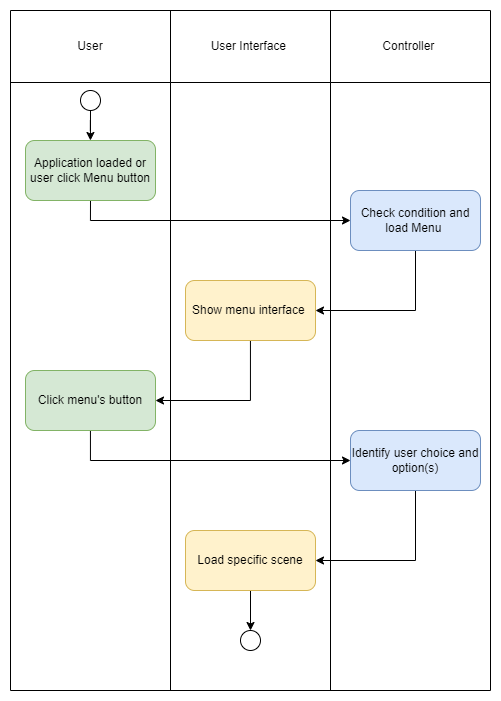

# JumpKing Game <!-- omit in toc -->

# Use-Case Specification: Menu<!-- omit in toc -->

## Table of Contents <!-- omit in toc -->
- [Menu](#connect-controller-cube)
  - [1.1 Brief Description](#11-brief-description)
- [2. Flow of Events](#2-flow-of-events)
  - [2.1 Basic Flow](#21-basic-flow)
    - [2.1.1 Activity Diagram](#211-activity-diagram)
    - [2.1.2 Mock Up](#212-mock-up)
- [3. Special Requirements](#3-special-requirements)
- [4. Preconditions](#4-preconditions)
- [4.1 User interact with menu](#41-user-interact-with-menu)
- [5. Postconditions](#5-postconditions)
  - [5.1 Scene loaded](#51-scene -loaded)
- [6. Extension Points](#6-extension-points)

## Connect Controller Cube

### 1.1 Brief Description
The menu is a necessary function for the game, reflecting the player's choices to load the screen, set the choice, pause the game etc.

## 2. Flow of Events

### 2.1 Basic Flow

#### 2.1.1 Activity Diagram

#### 2.1.2 Mock Up

## 3. Special Requirements

(n/a)

## 4. Preconditions

### 4.1 User interact with menu
User select menu option and submit.

## 5. Postconditions

### 5.1 Scene loaded
From user's choices then specify scene with selected options be loaded.

## 6. Extension Points

(n/a)
