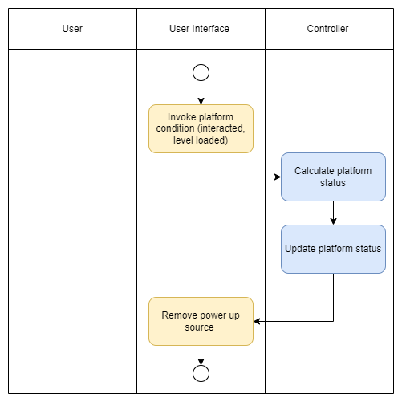

# JumpKing Game <!-- omit in toc -->

# Use-Case Specification: Platform  <!-- omit in toc -->

## Table of Contents <!-- omit in toc -->
- [Platform](#connect-controller-cube)
  - [1.1 Brief Description](#11-brief-description)
- [2. Flow of Events](#2-flow-of-events)
  - [2.1 Basic Flow](#21-basic-flow)
    - [2.1.1 Activity Diagram](#211-activity-diagram)
    - [2.1.2 Mock Up](#212-mock-up)
- [3. Special Requirements](#3-special-requirements)
- [4. Preconditions](#4-preconditions)
- [4.1 Level loaded](#41-level-loaded)
- [4.2 Character interaction](#42-character-interaction)
- [5. Postconditions](#5-postconditions)
  - [5.1 Platform updated](#51-platform-updated)
- [6. Extension Points](#6-extension-points)

## Connect Controller Cube

### 1.1 Brief Description
Character values can change when interacting with an power up source, which can be beneficial or detrimental to the player during gameplay.

## 2. Flow of Events

### 2.1 Basic Flow

#### 2.1.1 Activity Diagram

#### 2.1.2 Mock Up

## 3. Special Requirements

(n/a)

## 4. Preconditions

### 4.1 Level loaded
A level has to be loaded and the game has to be unpaused.
### 4.2 Character interaction
Some platform require interacted with character collider to make change, some does not.

## 5. Postconditions

### 5.1 Platform updated
Platform updated.

## 6. Extension Points

(n/a)
